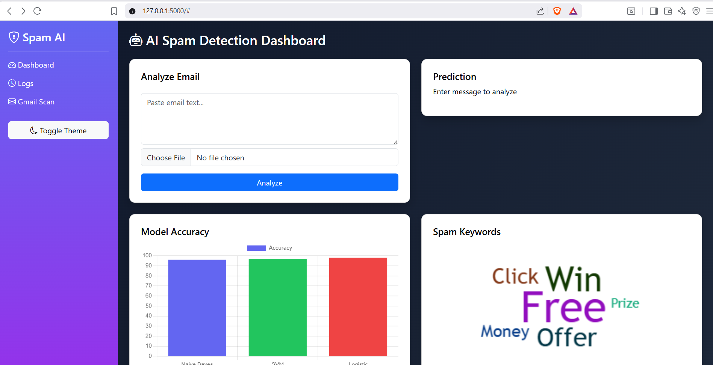
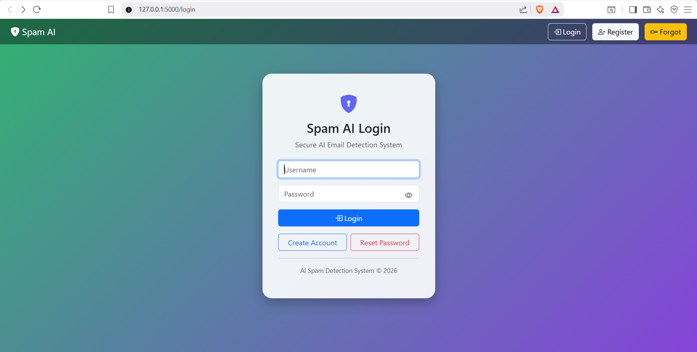
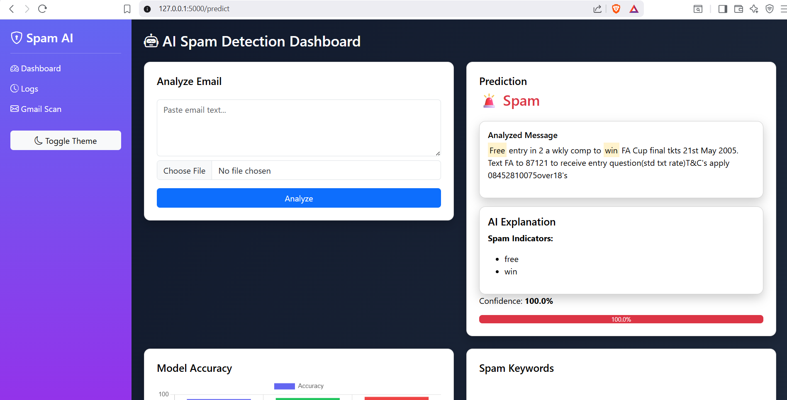
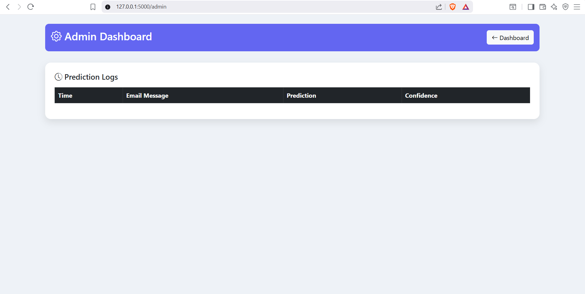

## 📸 Screenshots

### Dashboard


### Login Page


### Prediction Result


### Admin Panel


# 🤖 AI-Based Spam & Phishing Detection System

## 🚀 Overview

An industry-level AI web application that detects spam, phishing, and legitimate emails using Machine Learning and NLP techniques. Built with Flask and a modern interactive dashboard UI.

---

## ✨ Key Features

* 🔍 Spam Detection using ML models
* ⚠️ Phishing Detection system
* 🧠 Explainable AI (highlight spam words + reasoning)
* 📊 Interactive Dashboard (Chart.js + WordCloud)
* 📂 File Upload (analyze .txt / email files)
* 📧 Gmail Inbox Scanner (demo integration)
* 🔐 User Authentication (Login/Register/Forgot Password)
* 📜 Admin Panel with logs tracking

---

## 🧠 Machine Learning Models Used

* Multinomial Naive Bayes
* Logistic Regression
* Support Vector Machine (SVM)

✔ Best model selected using performance comparison

---

## ⚙️ Tech Stack

* Python
* Flask
* Scikit-learn
* Pandas, NumPy
* NLTK (NLP preprocessing)
* HTML, CSS, Bootstrap
* Chart.js

---

## 📊 Model Evaluation

* Accuracy
* Precision
* Recall
* F1-score
* Confusion Matrix

---

## 📸 Screenshots

(Add your screenshots here)

---

## 🛠️ Installation

```bash
git clone https://github.com/YOUR_USERNAME/AI-Spam-Detection-System.git
cd AI-Spam-Detection-System
pip install -r requirements.txt
python model_training.py
python app.py
```

---

## 🌐 Future Enhancements

* Cloud deployment (AWS / Render)
* Database integration (MongoDB)
* Email OTP authentication
* Real-time Gmail API integration
* AI-based threat scoring system

---

## 👨‍💻 Author

**Adi Raj**

---

## ⭐ Show Your Support

If you like this project, give it a ⭐ on GitHub!
